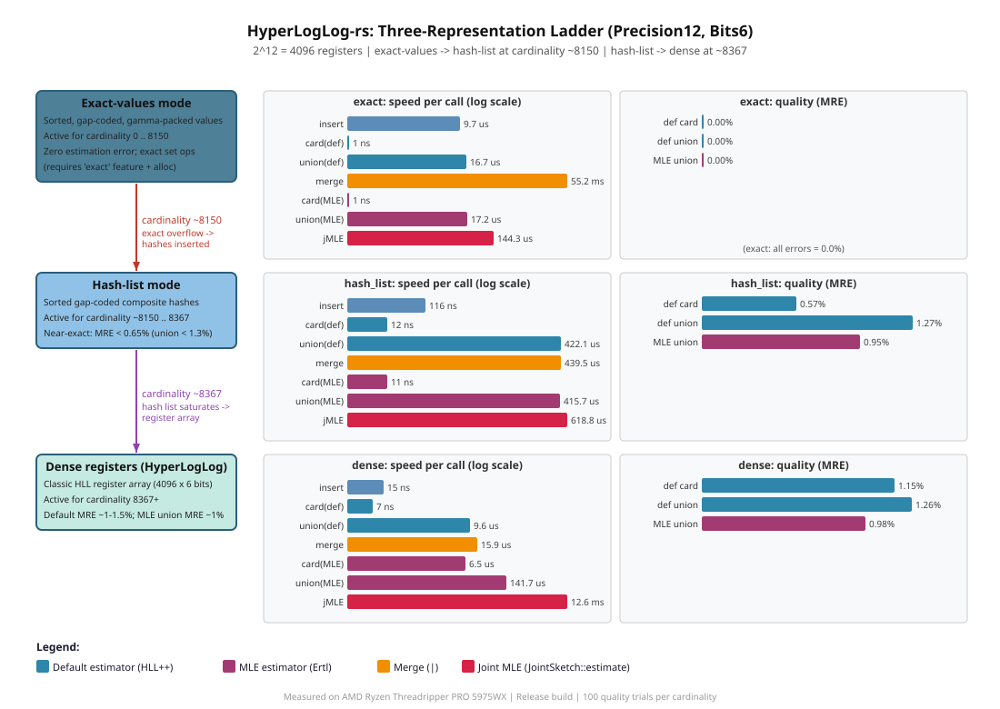

# 🧮 HyperLogLog-rs

[](https://crates.io/crates/hyperloglog-rs)
[](https://crates.io/crates/hyperloglog-rs/reverse_dependencies)
[](https://github.com/LucaCappelletti94/hyperloglog-rs/actions)

[](https://crates.io/crates/hyperloglog-rs)
[](https://docs.rs/hyperloglog-rs)

This is a Rust library that provides a memory-parsimonious implementation of the `HyperLogLog` (HLL) algorithm. You can use it to estimate the cardinality of large sets, and to estimate the union, intersection, difference and Jaccard index of two sets.

A counter automatically picks the smallest of three internal representations as it fills up: an exact list of the inserted values (with the `exact` feature, for absolute accuracy at low cardinalities), a compact sorted hash list, and finally the dense register array of the classic HyperLogLog. With the optional `mle` feature it additionally offers Maximum Likelihood Estimation of the union and of generalized hypersphere sketches, which can be more accurate than the default estimators at the cost of being slower.

The register type and the hasher are type parameters with sensible defaults, so the common counter is simply `HyperLogLog<P, B>`, where `P` is the precision (the number of registers is `2^P`) and `B` is the number of bits per register.

## Usage

Add this to your `Cargo.toml`:

```toml
[dependencies]
hyperloglog-rs = "0.1"
```

## Examples

### Cardinality and set operations

Counting and set operations live on the `CardinalityEstimator` trait (brought in by the prelude). The two required methods are `estimate_cardinality` and `estimate_union_cardinality`, and from them the trait derives `estimate_intersection_cardinality`, `estimate_difference_cardinality` and `estimate_jaccard_index`. Two counters are merged into a new one with the `|` operator.

```rust
use hyperloglog_rs::prelude::*;

let mut hll = HyperLogLog::<Precision6, Bits5>::default();
hll.insert(&1);
hll.insert(&2);

let mut hll2 = HyperLogLog::<Precision6, Bits5>::default();
hll2.insert(&2);
hll2.insert(&3);

let union = &hll | &hll2;

let estimated_cardinality: f64 = union.estimate_cardinality();
assert!(
estimated_cardinality >= 3.0_f64 * 0.9 &&
estimated_cardinality <= 3.0_f64 * 1.1,
"Expected cardinality to be around 3, got {}",
estimated_cardinality
);

let intersection_cardinality: f64 = hll.estimate_intersection_cardinality(&hll2);

assert!(
        intersection_cardinality >= 1.0_f64 * 0.9 &&
        intersection_cardinality <= 1.0_f64 * 1.1,
        "Expected intersection cardinality to be around 1, got {}",
        intersection_cardinality
);

// The Jaccard index and the difference cardinality come from the same trait.
let _jaccard: f64 = hll.estimate_jaccard_index(&hll2);
let _difference: f64 = hll.estimate_difference_cardinality(&hll2);
```

Because the estimators are trait methods, code generic over `CardinalityEstimator` works with any counter and with the MLE view described below:

```rust
use hyperloglog_rs::prelude::*;

fn jaccard<E: CardinalityEstimator>(left: &E, right: &E) -> f64 {
    left.estimate_jaccard_index(right)
}
```

### Maximum Likelihood Estimation

With the optional `mle` feature, the [joint Maximum Likelihood Estimation for HyperLogLog counters by Otmar Ertl](https://oertl.github.io/hyperloglog-sketch-estimation-paper/paper/paper.pdf) becomes available. It maximizes the joint likelihood of the two counters' register multiplicities and can be more accurate than the default union estimator, at the cost of being slower. It is exposed as a mode rather than a separate set of methods: calling `.mle()` on a counter returns a lightweight view whose `CardinalityEstimator` methods route through the MLE instead of the default HyperLogLog++ estimators (hash-list operands are materialized into registers first). Use `Mle::into_inner` to go back to the default-estimator counter.

The joint union estimator is the one worth using. The single-counter MLE cardinality (`hll.mle().estimate_cardinality()`) is provided for completeness but is dominated by the default HyperLogLog++ corrected estimate, so prefer the default for plain cardinality.

```rust
# #[cfg(feature = "mle")] {
use hyperloglog_rs::prelude::*;

let mut hll1 = HyperLogLog::<Precision10, Bits6>::default();
let mut hll2 = HyperLogLog::<Precision10, Bits6>::default();

for value in 0..10_000_u64 {
    hll1.insert(&value);
}
for value in 5_000..15_000_u64 {
    hll2.insert(&value);
}

// The true union cardinality of [0, 10000) and [5000, 15000) is 15000.
let mle_union: f64 = hll1.mle().estimate_union_cardinality(&hll2.mle());
assert!(
    mle_union >= 15_000.0_f64 * 0.9 && mle_union <= 15_000.0_f64 * 1.1,
    "MLE: Expected union cardinality to be around 15000, got {}",
    mle_union
);
# }
```

For more than two sets, `JointSketch::estimate` runs a single optimization over `M` nested left counters and `N` nested right counters, returning a `JointSketch<M, N>` that holds every disjoint-region cardinality at once: the `overlap[i][j]` grid of exclusive intersections plus the `left_diff` and `right_diff` margins. Its `union` method sums all the cells. Just as in the scalar case, putting the operands in `.mle()` mode selects the joint MLE (plain counters would instead give the faster pairwise inclusion-exclusion estimate). Pick a specific optimizer with `JointSketch::estimate_with` (for example `Lbfgs` alone where the objective is unimodal).

```rust
# #[cfg(feature = "mle")] {
use hyperloglog_rs::prelude::*;
type Hll = HyperLogLog<Precision12, Bits6>;

let mut a = Hll::default();
let mut b = Hll::default();
for x in 0u64..4_000 {
    a.insert(&x);
}
for x in 2_000u64..6_000 {
    b.insert(&x);
}

let sketch = JointSketch::estimate(&[a.mle()], &[b.mle()]);
// sketch.overlap[i][j] is |left_i intersect right_j|; here the single shared cell.
assert!((sketch.overlap[0][0] - 2_000.0).abs() / 2_000.0 < 0.25);
// sketch.union() sums the overlap grid and the left and right margins.
assert!((sketch.union() - 6_000.0).abs() / 6_000.0 < 0.2);
# }
```

## Feature flags

All features are off by default, so the crate is `no_std` with no allocator out of the box.

- `alloc`: enable allocation-backed functionality. The default `HyperLogLog<P, B>` stores its registers inline as a fixed-size array; the `VecHll<P, B>` alias instead backs them with a heap-allocated, growable vector, which is preferable when the register array would be large (high precision) or when many counters are created dynamically.
- `mle`: enable the Maximum Likelihood estimators. This works in `no_std + alloc` (it uses `alloc::collections::BTreeMap` and routes the float transcendentals to `libm` when `std` is unavailable, to the standard library otherwise), so it implies `alloc`.
- `exact`: enable the exact-values representation, which stores the inserted integers exactly (sorted, gap-coded and Elias-gamma packed, so they are recoverable) for absolute accuracy and exact set operations at low cardinalities before the counter switches to the hash list. Implies `alloc`.
- `std`: use the Rust standard library (implies `alloc`).

```rust
# #[cfg(feature = "alloc")] {
use hyperloglog_rs::prelude::*;

// Same API as the array-backed counter, but the registers live on the heap.
let mut hll = VecHll::<Precision10, Bits6>::default();
hll.insert(&1);
let _cardinality: f64 = hll.estimate_cardinality();
# }
```

## Benchmarks

The diagram below shows the three-layer ladder and the measured thresholds for `HyperLogLog<Precision12, Bits6>` (4096 registers, 6 bits each). Switch points were detected empirically by inserting values one at a time and watching the `is_exact` / `is_hash_list` / `is_dense` predicates flip.



All measurements were taken on an AMD Ryzen Threadripper PRO 5975WX (release build, `--features "std mle exact"`). Each speed number is the median of 5 calibrated runs in nanoseconds per call, and `insert` is measured amortized (a batch of fresh values into one counter, divided by the batch size) so it excludes the cost of cloning the counter. Every two-operand measurement (`est union`, `merge`, the sketch columns) uses two counters each of the row's cardinality, built at 50 percent overlap, so the true union is about 1.5x the row value. Quality columns are mean relative error (MRE) over 100 independent trials against an exact `HashSet` ground truth. The joint sketch is measured at `M = N = 1` (one left counter against one right counter), so it decomposes that single pair into one intersection cell plus the two differences. The `sketch(def)` and `sketch(MLE)` columns are the time to compute that whole sketch, while `def inter MRE` and `MLE inter MRE` are the error of its single intersection cell (`overlap[0][0]`), default versus MLE. Run `cargo run --release --example regime_benchmarks --features "std mle exact"` to reproduce, and find the raw numbers in `docs/regime_benchmarks.json`.

**MLE only runs on dense operands.** MLE is a register-multiplicity estimator, so it activates only once a counter is in dense mode (or after a hashed counter is materialized). In the `exact` and `hash_list` regimes the `.mle()` calls dispatch to the exact (or near-exact hash-list) set algebra instead, so no MLE runs there at all and the MLE columns (`MLE union`, `sketch(MLE)`, `MLE inter MRE`) are shown as `n/a`. The genuine default-vs-MLE comparison is the dense regime.

**Switch points.** For this counter the `exact` to `hash_list` transition happens around cardinality 8150, when the growable exact-values buffer reaches the register-array footprint and the stored values are hashed into a proper hash list. The `hash_list` to `dense` transition happens around cardinality 8367, when the hash list saturates and the crate materializes the classic register array. The exact thresholds shift slightly with the hashed values, so with the `exact` feature on the hash-list stage is a brief transitional band rather than a wide regime.

| cardinality | regime | insert | est card | est union | merge | sketch(def) | MLE union | sketch(MLE) | def card MRE | def union MRE | def inter MRE | MLE inter MRE |
|---:|:---:|---:|---:|---:|---:|---:|---:|---:|---:|---:|---:|---:|
| 1 | exact | 1.4 us | 1 ns | 201 ns | 879 ns | 273 ns | n/a | n/a | 0.00% | 0.00% | 0.00% | n/a |
| 2716 | exact | 9.8 us | 1 ns | 17.8 us | 62.7 us | 17.1 us | n/a | n/a | 0.00% | 0.00% | 0.00% | n/a |
| 5383 | exact | 17.5 us | 1 ns | 35.1 us | 121.5 us | 34.7 us | n/a | n/a | 0.00% | 0.00% | 0.00% | n/a |
| 8204 | hash_list | 155 ns | 11 ns | 570.7 us | 563.0 us | 585.6 us | n/a | n/a | 0.56% | 0.94% | 2.93% | n/a |
| 8313 | hash_list | 79 ns | 12 ns | 248.3 us | 250.1 us | 237.1 us | n/a | n/a | 0.58% | 1.60% | 4.98% | n/a |
| 8567 | dense | 15 ns | 11 ns | 9.1 us | 15.4 us | 9.3 us | 150.0 us | 10.8 ms | 1.12% | 10.26% | 31.07% | 1.56% |
| 16384 | dense | 15 ns | 11 ns | 9.1 us | 15.6 us | 9.6 us | 131.4 us | 10.9 ms | 1.04% | 1.09% | 2.38% | 1.76% |
| 65536 | dense | 16 ns | 3 ns | 9.3 us | 15.1 us | 9.1 us | 124.8 us | 12.9 ms | 1.19% | 1.21% | 2.69% | 2.16% |
| 262144 | dense | 16 ns | 3 ns | 9.5 us | 15.9 us | 9.5 us | 155.1 us | 13.1 ms | 1.45% | 1.30% | 2.52% | 2.03% |

A few observations. In `exact` mode every cardinality, union and intersection is exact (0 percent error) because the inserted values are stored exactly (sorted, gap-coded and gamma-packed), and `estimate_cardinality` is essentially free (about 1 ns, it reads the stored count). The cost in `exact` mode is in mutation: each `insert` splices the gap-coded value buffer in place, so it grows with the stored cardinality (1.4 us to 18 us here). The `merge` is a two-pointer union of the two sorted value streams written once (60 to 120 us at a few thousand values), not a re-insertion of each value, so it stays linear in the combined cardinality.

In `hash_list` mode the accuracy is near-exact for cardinality and union (under 1.6 percent), but the default pairwise sketch's intersection is noticeably worse. It derives the intersection as `card_a + card_b - union`, and that subtraction amplifies the small relative errors, giving a `def inter MRE` of 3 to 5 percent. This narrow band's two-operand costs (around 230 to 590 us) fall as the cardinality grows and the hash list downsamples to fewer bits per stored hash.

In `dense` mode the default operations are cheap and flat regardless of cardinality: `insert` about 15 ns, `estimate_cardinality` a few ns, `estimate_union_cardinality` and `sketch(def)` about 9 us, and `merge` about 15 us (an element-wise register maximum). This is the only regime where MLE runs. The MLE union (`hll.mle().estimate_union_cardinality(..)`) costs about 130 to 155 us and trims union MRE to near 1 percent, and it is robust at the dense transition (cardinality 8567), where the plain inclusion-exclusion union briefly jumps to 10 percent. The effect is far stronger for the intersection: the default pairwise sketch's `def inter MRE` is about 2.4 to 2.7 percent in steady state and spikes to 31 percent at the transition, while the MLE joint sketch (`JointSketch::estimate` over `.mle()` views) holds `MLE inter MRE` at 1.6 to 2.2 percent throughout. That accuracy is the reason to pay its roughly 11 to 13 ms per call (the full Adam plus L-BFGS optimization), which also returns the complete overlap and margin decomposition.

## No STD

This crate is designed to be as lightweight as possible and does not require any dependencies from the Rust standard library (std). As a result, it can be used in a bare metal or embedded context, where std may not be available. With the `alloc` feature it can use an allocator without pulling in std, and even the optional MLE estimation runs in `no_std + alloc`.

## Fuzzing

Fuzzing is a technique for finding security vulnerabilities and bugs in software by providing random input to the code. We make sure that our fuzz targets are continuously updated and run against the latest versions of the library to ensure that any vulnerabilities or bugs are quickly identified and addressed.

[Learn more about how we fuzz here](https://github.com/LucaCappelletti94/hyperloglog-rs/tree/main/fuzz)

## Citations

Some relevant citations to learn more:

- Philippe Flajolet, Eric Fusy, Olivier Gandouet, Frédéric Meunier. "[HyperLogLog: the analysis of a near-optimal cardinality estimation algorithm.](https://hal.science/file/index/docid/406166/filename/FlFuGaMe07.pdf)" In Proceedings of the 2007 conference on analysis of algorithms, pp. 127-146. 2007.
