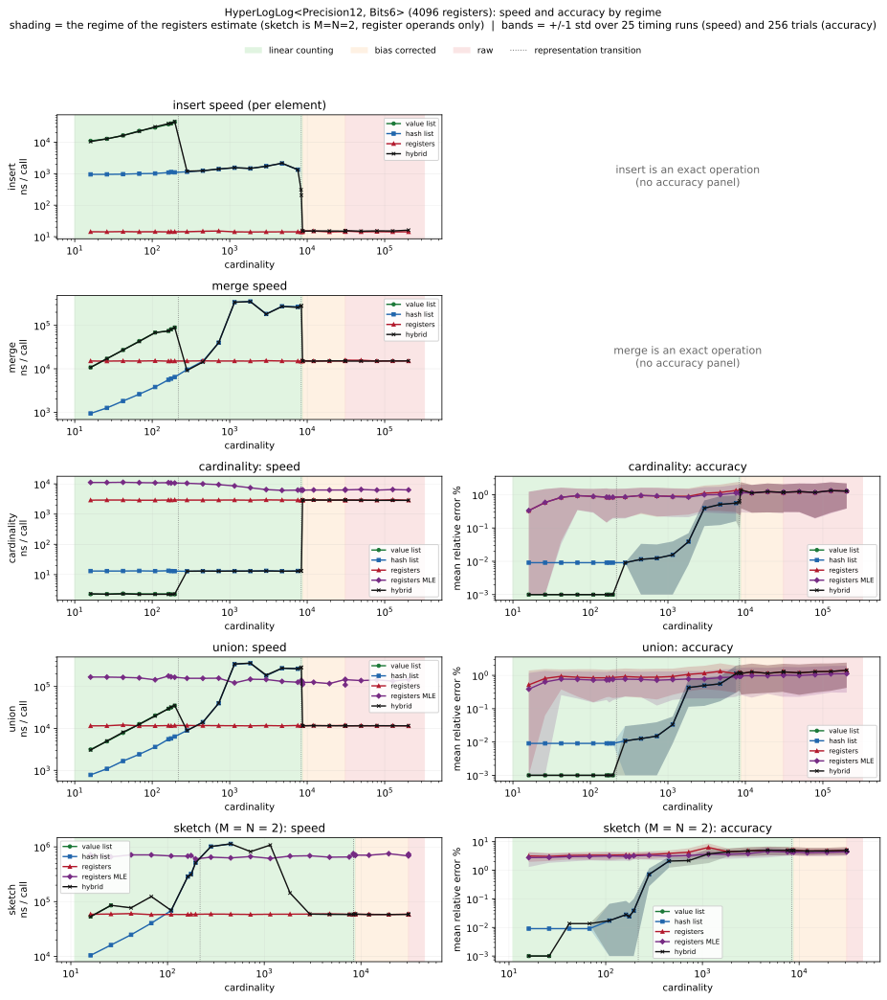

# 🧮 HyperLogLog-rs

[](https://crates.io/crates/hyperloglog-rs)
[](https://crates.io/crates/hyperloglog-rs/reverse_dependencies)
[](https://github.com/LucaCappelletti94/hyperloglog-rs/actions)

[](https://crates.io/crates/hyperloglog-rs)
[](https://docs.rs/hyperloglog-rs)

This is a Rust library that provides a memory-parsimonious implementation of the `HyperLogLog` (HLL) algorithm. You can use it to estimate the cardinality of large sets, and to estimate the union, intersection, difference and Jaccard index of two sets.

A counter automatically picks the smallest of three internal representations as it fills up: an exact list of the inserted values (with the `exact` feature, for absolute accuracy at low cardinalities), a compact sorted hash list, and finally the dense register array of the classic `HyperLogLog`. It additionally offers (always available) Maximum Likelihood Estimation of the union and of generalized hypersphere sketches, which can be more accurate than the default estimators at the cost of being slower.

The register type and the hasher are type parameters with sensible defaults, so the common counter is simply `HyperLogLog<P, B>`, where `P` is the precision (the number of registers is `2^P`) and `B` is the number of bits per register.

## Usage

Add this to your `Cargo.toml`:

```toml
[dependencies]
hyperloglog-rs = "0.1"
```

## Examples

### Cardinality and set operations

Counting and set operations live on the `CardinalityEstimator` trait (brought in by the prelude). The two required methods are `estimate_cardinality` and `estimate_union_cardinality`, and from them the trait derives `estimate_intersection_cardinality`, `estimate_difference_cardinality` and `estimate_jaccard_index`. Two counters are merged into a new one with the `|` operator.

```rust
use hyperloglog_rs::prelude::*;

let mut hll = HyperLogLog::<Precision6, Bits5>::default();
hll.insert(&1);
hll.insert(&2);

let mut hll2 = HyperLogLog::<Precision6, Bits5>::default();
hll2.insert(&2);
hll2.insert(&3);

let union = &hll | &hll2;

let estimated_cardinality: f64 = union.estimate_cardinality();
assert!(
estimated_cardinality >= 3.0_f64 * 0.9 &&
estimated_cardinality <= 3.0_f64 * 1.1,
"Expected cardinality to be around 3, got {}",
estimated_cardinality
);

let intersection_cardinality: f64 = hll.estimate_intersection_cardinality(&hll2);

assert!(
        intersection_cardinality >= 1.0_f64 * 0.9 &&
        intersection_cardinality <= 1.0_f64 * 1.1,
        "Expected intersection cardinality to be around 1, got {}",
        intersection_cardinality
);

// The Jaccard index and the difference cardinality come from the same trait.
let _jaccard: f64 = hll.estimate_jaccard_index(&hll2);
let _difference: f64 = hll.estimate_difference_cardinality(&hll2);
```

Because the estimators are trait methods, code generic over `CardinalityEstimator` works with any counter and with the MLE view described below:

```rust
use hyperloglog_rs::prelude::*;

fn jaccard<E: CardinalityEstimator>(left: &E, right: &E) -> f64 {
    left.estimate_jaccard_index(right)
}
```

### Maximum Likelihood Estimation

Maximum Likelihood Estimation is always available. The [joint Maximum Likelihood Estimation for HyperLogLog counters by Otmar Ertl](https://oertl.github.io/hyperloglog-sketch-estimation-paper/paper/paper.pdf) is built in (no feature flag required). It maximizes the joint likelihood of the two counters' register multiplicities and can be more accurate than the default union estimator, at the cost of being slower. It is exposed as a mode rather than a separate set of methods: calling `.mle()` on a counter returns a lightweight view whose `CardinalityEstimator` methods route through the MLE instead of the default `HyperLogLog`++ estimators (hash-list operands are materialized into registers first). Use `Mle::into_inner` to go back to the default-estimator counter.

The joint union estimator is the one worth using. The single-counter MLE cardinality (`hll.mle().estimate_cardinality()`) is provided for completeness but is dominated by the default `HyperLogLog`++ corrected estimate, so prefer the default for plain cardinality.

```rust
use hyperloglog_rs::prelude::*;

let mut hll1 = HyperLogLog::<Precision10, Bits6>::default();
let mut hll2 = HyperLogLog::<Precision10, Bits6>::default();

for value in 0..10_000_u64 {
    hll1.insert(&value);
}
for value in 5_000..15_000_u64 {
    hll2.insert(&value);
}

// The true union cardinality of [0, 10000) and [5000, 15000) is 15000.
let mle_union: f64 = hll1.mle().estimate_union_cardinality(&hll2.mle());
assert!(
    mle_union >= 15_000.0_f64 * 0.9 && mle_union <= 15_000.0_f64 * 1.1,
    "MLE: Expected union cardinality to be around 15000, got {}",
    mle_union
);
```

For more than two sets, `JointSketch::estimate` decomposes `M` nested left counters and `N` nested right counters into a `JointSketch<M, N>` that holds every disjoint-region cardinality at once: the `overlap[i][j]` grid of exclusive intersections plus the `left_diff` and `right_diff` margins. Its `union` method sums all the cells. Just as in the scalar case, putting the operands in `.mle()` mode estimates each cell from the maximum-likelihood union (exact set algebra while the counters are still pre-dense, otherwise pairwise inclusion-exclusion over Ertl's 2-set union MLE), while plain counters use the default `HyperLogLog`++ inclusion-exclusion.

```rust
use hyperloglog_rs::prelude::*;
type Hll = HyperLogLog<Precision12, Bits6>;

let mut a = Hll::default();
let mut b = Hll::default();
for x in 0u64..4_000 {
    a.insert(&x);
}
for x in 2_000u64..6_000 {
    b.insert(&x);
}

let sketch = JointSketch::estimate(&[a.mle()], &[b.mle()]);
// sketch.overlap[i][j] is |left_i intersect right_j|; here the single shared cell.
assert!((sketch.overlap[0][0] - 2_000.0).abs() / 2_000.0 < 0.25);
// sketch.union() sums the overlap grid and the left and right margins.
assert!((sketch.union() - 6_000.0).abs() / 6_000.0 < 0.2);
```

### Error estimation

Every estimator reports its own theoretical error, computed in closed form from the counter's state, so an estimate can travel with an error bar. The relative standard error and the systematic bias are reported separately, both at the counter's current estimate and at an arbitrary cardinality. There is also a per-cell error grid for the joint sketch ([`HyperLogLog::joint_sketch_error`]), which surfaces the large relative error of small overlap cells, and a threshold telling you the cardinality above which the slower maximum-likelihood estimator becomes more accurate than the raw one.

```rust
use hyperloglog_rs::prelude::*;
type Hll = HyperLogLog<Precision12, Bits6>;

let mut a = Hll::default();
for x in 0u64..50_000 {
    a.insert(&x);
}

// The estimate plus its predicted relative standard error (about 1.04/sqrt(2^12) in range) and bias.
let _estimate = a.estimate_cardinality();
let rse = a.predicted_relative_standard_error();
assert!(rse > 0.0 && rse < 0.05);
let _bias = a.predicted_bias(); // negligible away from saturation

// The error at an arbitrary cardinality (the type alone fixes it), and the maximum-likelihood
// preferred threshold (None when the registers never saturate in range, as with Bits6).
let _rse_at = a.relative_standard_error_at(1_000_000.0);
assert!(mle_preferred_threshold::<Precision12, Bits6>().is_none());
```

### Adaptive estimation

The default register estimate is O(1) and accurate over the whole normal range, but as tiny registers saturate it develops a large systematic bias (it flatlines at its ceiling), while the much slower maximum-likelihood estimate stays accurate for a window past that point. [`HyperLogLog::adaptive`] returns a borrowing view that picks the estimator with the smaller predicted error per counter: the cheap default everywhere except inside that saturation window, where it pays for the MLE. For wide registers (such as `Bits6`) that never saturate in range the window is empty, so the view is identical to the default and free. Because it implements the same [`CardinalityEstimator`] and [`HyperSpheresSketch`] traits, the derived intersection, Jaccard, and difference estimates come along for free.

```rust
use hyperloglog_rs::prelude::*;

let mut counter = HyperLogLog::<Precision12, Bits6>::default();
for x in 0u64..40_000 {
    counter.insert(&x);
}

// Auto-selects raw vs MLE; here Bits6 never saturates, so it matches the default.
let estimate = counter.adaptive().estimate_cardinality();
assert!((estimate - 40_000.0).abs() / 40_000.0 < 0.1);
```

## Feature flags

All features are off by default, so the crate is `no_std` with no allocator out of the box.

- `alloc`: enable allocation-backed functionality. The default `HyperLogLog<P, B>` stores its registers inline as a fixed-size array; the `VecHll<P, B>` alias instead backs them with a heap-allocated, growable vector, which is preferable when the register array would be large (high precision) or when many counters are created dynamically.
- `exact`: enable the exact-values representation, which stores the inserted integers exactly (sorted, gap-coded and Elias-gamma packed, so they are recoverable) for absolute accuracy and exact set operations at low cardinalities before the counter switches to the hash list. Implies `alloc`.
- `std`: use the Rust standard library (implies `alloc`).

```rust
# #[cfg(feature = "alloc")] {
use hyperloglog_rs::prelude::*;

// Same API as the array-backed counter, but the registers live on the heap.
let mut hll = VecHll::<Precision10, Bits6>::default();
hll.insert(&1);
let _cardinality: f64 = hll.estimate_cardinality();
# }
```

## Benchmarks

A counter passes through five cardinality-estimation regimes as it grows: the exact `value list`, the `hash list`, and three register regimes (`linear counting` at low load, the empirical `bias corrected` regime, and the uncorrected `raw` regime above `7.5 * m`). The figure below sweeps cardinality for `HyperLogLog<Precision12, Bits6>` (4096 registers) and, for each task, compares the available modalities: the `value list` and `hash list` representations where they still fit, the `registers` curve (the standard register estimate you get without calling `.mle()`, which applies linear counting, bias correction or the raw formula by load), and `registers MLE` (the maximum-likelihood register estimate). The black `hybrid` curve is the real counter that switches representations on its own (`value list`, then `hash list`, then `registers`), so it traces the actual path a user would see and exposes any cost at the transitions. Every curve carries a one-standard-deviation band (over the timing runs for speed, over the trials for accuracy).



The shaded bands are the regime of the `registers` estimate. Because that curve forces the counter dense at every cardinality with `into_hll`, it is in `linear counting` for the whole range below the threshold (not just the narrow band where a naturally grown counter happens to be dense), then `bias corrected`, then `raw`. The dotted verticals mark the representation transitions (where the `value list` and `hash list` give out).

The tasks are `insert` and `merge` (the actual object union `&a | &b`), which are exact operations measured for speed only, and the estimation tasks `cardinality`, `union` (the union cardinality estimate), and the joint `sketch`. The derived set operations (intersection, jaccard, difference) are all `union` plus the marginal cardinalities, so they carry no independent signal and are not shown. The sketch is measured at `M = N = 2` (a trivial `M = N = 1` sketch is just `union` and the marginals): its eight differential cells let the error compound, and it runs in every representation it fits in, dispatching to the exact set algebra on the value and hash lists, so MLE is a distinct estimator only on register operands. The benchmarked values are random (a near-sequential stream gap-compresses so well that the value list would survive to absurd cardinalities), so the value list here saturates around 200 elements.

The tradeoff is clear. The `value list` and `hash list` keep every task exact or near-exact, but their insertion is `O(n)` (each insert splices a sorted, gap-coded buffer), so insertion cost grows with the stored cardinality. The `value list` is in fact slower per insert than the `hash list` at the same cardinality. Both are sorted, delta-coded bitstreams, but the value list gamma-codes the gaps between the literal `u64` values, which for random input are near full width (about 14 bytes each, since a couple hundred values are spread across the whole `2^64` range), while the hash list gap-codes downsampled composite hashes that live in a far smaller space (a few bytes each). The value list also sits near its small ~200-value capacity, so each in-place splice re-encodes more bits. The register array inverts this: insertion is a flat `O(1)` register update, but the estimators are approximate. Both `cardinality` and `union` stay around 1 percent across the whole register range, including the sparse low-load end, because linear counting corrects the low-load bias and is applied to the union as well as the single counter (the union estimate runs through the same corrector). The `registers` sketch is a few percent at low load and `registers MLE` trims it a little further, so on register operands the maximum-likelihood path buys its 10x to 100x time cost mainly on the deeper joint-sketch cells, where the inclusion-exclusion error compounds, rather than on plain `cardinality` or `union`.

The `hybrid` curve shows what the transitions actually cost. For insertion every hinge is a gain: each switch drops the per-element cost (value list around 10 to 40 us, hash list around 1 to 2 us, registers around 15 ns), so the two transitions appear as sharp downward steps. For accuracy the hash list to registers hinge near cardinality 8400 shows a single unavoidable step in `cardinality`: the hash list there is near-exact (error under 0.6 percent) because it counts its stored hashes directly, but once it saturates it is forced to convert to registers, which keep only one number per bucket and discard the per-element hashes, so the estimate drops to `HyperLogLog`'s inherent standard error and the `hybrid` `cardinality` error steps up to about 1.2 percent. That step is fundamental once the hash list runs out of space. The only way to keep the lower error is to carry the hash list further before converting. The `union` and the `sketch` stay smooth across both transitions (no spike), and the value list to hash list hinge near cardinality 217 is painless (exact to near-exact).

Reproduce with `cargo run --release --example regime_benchmarks` (which writes `docs/regime_benchmarks.json`) and render the figure with `env -u PYTHONPATH uv run --isolated --no-project --python 3.12 --with matplotlib python3 docs/make_regime_plots.py`. Measured on an AMD Ryzen Threadripper PRO 5975WX, release build, with one-standard-deviation bands over 9 timing runs and 64 accuracy trials.

## No STD

This crate is designed to be as lightweight as possible and does not require any dependencies from the Rust standard library (std). As a result, it can be used in a bare metal or embedded context, where std may not be available. With the `alloc` feature it can use an allocator without pulling in std, and even the optional MLE estimation runs in `no_std + alloc`.

## Citations

Some relevant citations to learn more:

- Philippe Flajolet, Eric Fusy, Olivier Gandouet, Frédéric Meunier. "[HyperLogLog: the analysis of a near-optimal cardinality estimation algorithm.](https://hal.science/file/index/docid/406166/filename/FlFuGaMe07.pdf)" In Proceedings of the 2007 conference on analysis of algorithms, pp. 127-146. 2007.
